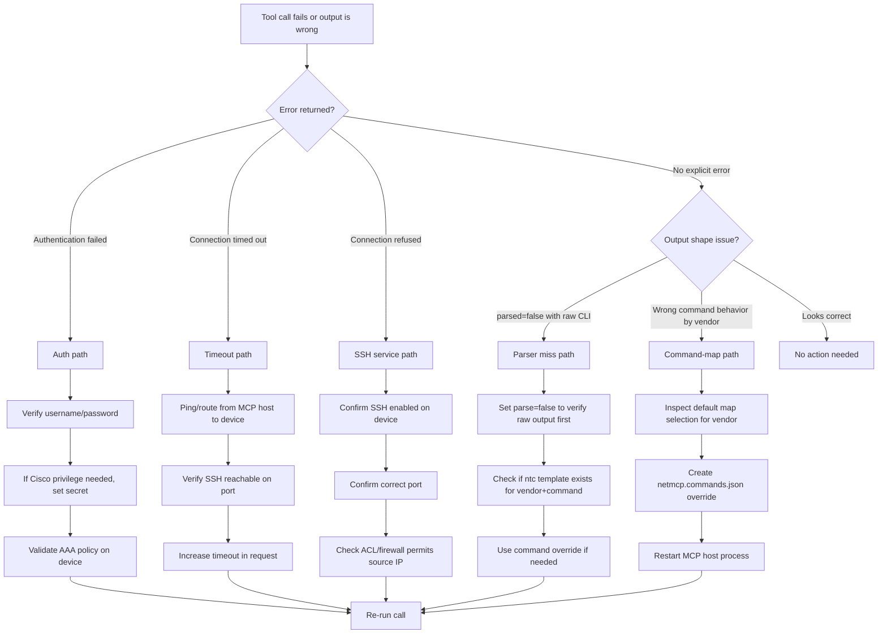

# netmcp Troubleshooting Flow

Use this guide when a tool call fails or returns unexpected output.

- Docs index: [DOCS_HUB.md](../DOCS_HUB.md)
- Technical overview: [TECHNICAL_OVERVIEW.md](../strategy/TECHNICAL_OVERVIEW.md)
- Architecture diagrams: [TECHNICAL_VISUAL_MAP.md](../visuals/TECHNICAL_VISUAL_MAP.md)

---

## Fast Triage Decision Tree



---

## Error Type Playbook

### 1) Authentication failed

Typical cause:

- Wrong credentials or missing privilege escalation (`secret`) for platforms that need enable mode.

Checks:

- Confirm `username`/`password`
- Provide `secret` for Cisco privileged commands
- Confirm local AAA/tacacs/radius policy allows the account

---

### 2) Connection timed out

Typical cause:

- Reachability/path issue, blocked TCP/22, or timeout too low.

Checks:

- Test IP reachability from the machine running `netmcp`
- Confirm SSH daemon is up on device
- Confirm ACL/firewall paths permit source to destination SSH
- Increase request `timeout`

---

### 3) Connection refused

Typical cause:

- Host reachable, but SSH not listening on target port.

Checks:

- Verify SSH service state
- Verify configured SSH port matches request `port`
- Confirm no host-based deny rules

---

### 4) Parser miss (`parsed=false`)

Typical cause:

- No matching ntc-template for that exact vendor + command variant.

Checks:

- Run same tool with `parse=false` to inspect raw output
- Try a more canonical command form
- Use override file to standardize command per vendor

---

### 5) Vendor command mismatch

Typical cause:

- Built-in map command does not match your environment/OS train.

Fix path:

1. Create `netmcp.commands.json` in working directory (or set `NETMCP_COMMAND_OVERRIDES`)
2. Override only needed keys (`inventory`, `ping`, `config`)
3. Restart process and verify via `net_vendors` (`command_overrides` field)

---

## Known Good Validation Sequence

1. Compile check

```bash
python -m py_compile netmcp/server.py
```

2. Import check

```bash
python -c "import netmcp.server as s; print(s.VERSION, s.SERVER_NAME, len(s.SUPPORTED_VENDORS))"
```

3. Override load check

```bash
python -c "import netmcp.server as s; print(s.COMMAND_OVERRIDE_STATUS)"
```

4. Packaging sanity

```bash
python -m pip install -e . --no-deps
```

---

## Escalation Trigger

Escalate deeper debugging when all are true:

- Connectivity/auth checks pass
- Command works manually on device CLI
- `netmcp` still returns errors for same command/vendor

At that point, capture:

- Vendor key used
- Command string used
- `COMMAND_OVERRIDE_STATUS`
- Raw output with `parse=false`
- Exact error payload returned by tool
