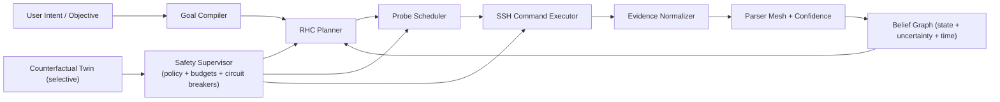
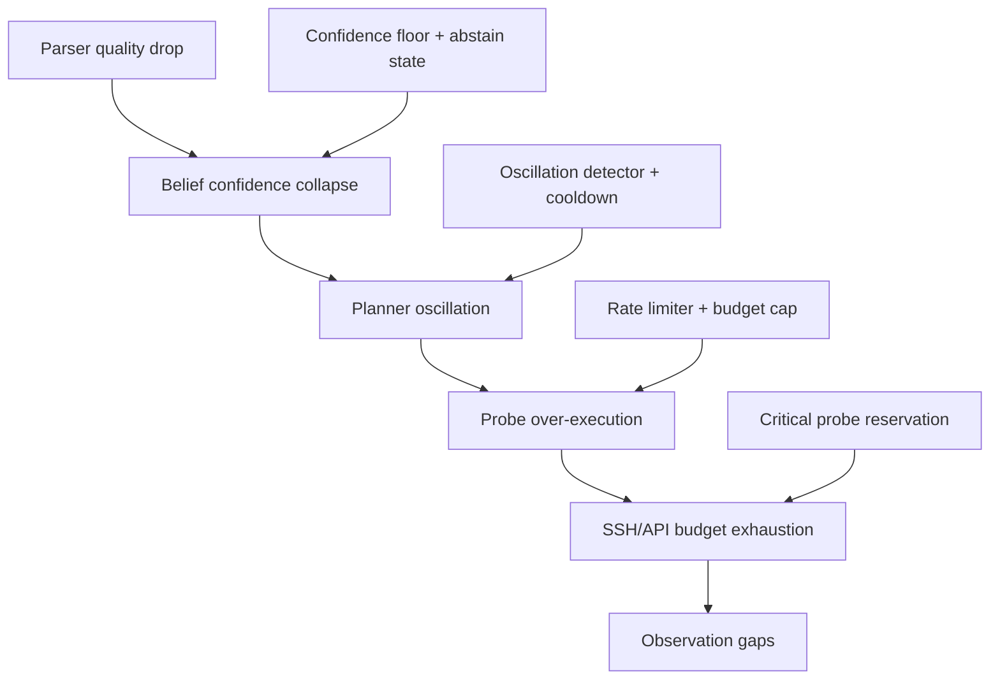

# netmcp vNext Breakthrough Blueprint

Date: 2026-03-05
Scope: `c:\Users\rtseg\__PROJECTS__\netmcp`

---

## 0) Executive thesis

**Step-function gain does not come from more commands; it comes from a closed-loop control plane that minimizes uncertainty per unit risk.**

Current `netmcp` is a high-quality observation transducer. vNext should become a **confidence-gated belief controller**.

---

## 1) Recursive abstraction

### Level A — Concrete system

Today:

1. Validate request input.
2. Execute command over SSH (Netmiko).
3. Optionally parse command output.
4. Return result to caller.

Strength: deterministic and low-friction.
Weakness: mostly stateless, weak feedback accumulation.

### Level B — Functional pattern

This is an **intent-to-evidence adapter** with thin control semantics. It observes well, but does limited temporal reasoning.

### Level C — Meta-pattern analogies

- **Biology**: strong sensory cortex, weak memory consolidation.
- **Operating systems**: syscall wrapper without scheduler feedback.
- **Distributed systems**: edge probes without durable world model.
- **Control theory**: open-loop with ad hoc retries instead of bounded, confidence-driven receding horizon control.

### Hidden structural pattern

The dominant bottleneck is **state uncertainty**, not tool count.

---

## 2) Divergent architecture candidates (fundamental shifts)

## Candidate A — Receding-Horizon Belief Controller (RHBC)

Core shift: from stateless tool calls to persistent belief state + iterative probe planning.

- Maintains world model with confidence scores.
- Chooses next command by information gain under risk/cost budget.
- Stops when confidence threshold or budget limit reached.

## Candidate B — Topology Agent Federation (TAF)

Core shift: split into domain agents (edge/core/security) coordinated by an arbiter.

- Strong modularity and parallelism.
- High coordination overhead and stale-global-state risk.

## Candidate C — Market Utility Allocator (MUA)

Core shift: command/probe actions bid for execution slots.

- Good under constrained resources.
- Fairness and starvation failures in low-visibility conditions.

## Candidate D — Counterfactual Twin Gate (CTG)

Core shift: evaluate proposed actions in a digital twin before live execution.

- Useful for high-risk actions.
- Model drift can silently degrade decisions.

## Candidate E — Uncertainty-First Parsing Mesh (UPM)

Core shift: parser ensemble + confidence estimator + disambiguation probes.

- Greatly improves evidence quality.
- Not sufficient alone for global planning.

---

## 3) Forward simulation under stress

## Stress S1 — Parser degradation after firmware change

- A: degrades gracefully; planner issues disambiguation probes.
- B: local agents diverge due to heterogeneous parse quality.
- C: low-confidence probes lose bids and blind spots persist.
- D: twin confidence may mask parse drift.
- E: strongest response to this stress.

## Stress S2 — Partial network partition

- A: confidence decay marks stale segments and avoids over-claiming.
- B: federation helps local continuity but global arbitration lags.
- C: utility market can overfocus on reachable zones.
- D: twin divergence grows quickly under partition.
- E: parser quality unaffected; situational completeness still suffers.

## Stress S3 — Conflicting goals (stability vs speed)

- A: explicit multi-objective planning with risk budgets works best.
- B: requires expensive cross-agent policy negotiation.
- C: bidding semantics can encode goals but hard to keep interpretable.
- D: twin helps risk estimation but not objective arbitration.
- E: orthogonal.

## Stress S4 — Tight API/SSH resource limits

- A: probe scheduler can enforce hard budgets.
- B: parallel agents can create thundering herd risk.
- C: naturally budget-aware; still unstable fairness.
- D: twin adds overhead.
- E: modest overhead, good signal quality.

---

## 4) Critical pruning

Rejected as primary control structure:

1. **Market-first (C)**
   - Fails interpretability under incident pressure.
   - Starvation risk for low-frequency but critical probes.

2. **Federation-first (B)**
   - Premature coordination complexity at current scale.
   - Global consistency lag exceeds benefit unless topology is very large.

3. **Twin-first (D)**
   - Drift management cost too high for default path.
   - Better as a selective high-risk gate, not baseline architecture.

Kept:

- **A (RHBC)** as control backbone.
- **E (UPM)** as evidence quality engine.
- **D (CTG)** only for high-risk workflows.

---

## 5) Synthesis — Confidence-Gated Hierarchical Control Plane

## Architectural idea

Combine a persistent belief graph with uncertainty-aware parsing and receding-horizon probe planning.

## Control objective

At each step, choose action \(a_t\) to maximize:

$$
\text{Leverage}(a_t)=\frac{\Delta I(a_t)}{R(a_t)\cdot C(a_t)\cdot L(a_t)}
$$

Subject to:

- risk budget \(\sum R(a*t) \le R*{max}\)
- probe budget \(\sum C(a*t) \le C*{max}\)
- confidence target \(Conf(state) \ge \tau\)

## Why this is a step-change

It turns `netmcp` from “execute requested command” into “actively reduce uncertainty toward a bounded-confidence answer.”

---

## 6) Component contracts (implementation level)

| Component         | Input                              | Output                           | State          | SLO                 |
| ----------------- | ---------------------------------- | -------------------------------- | -------------- | ------------------- |
| Goal Compiler     | intent + constraints               | objective vector                 | none           | <50ms               |
| Planner           | belief graph + objective + budgets | ranked next actions              | planning trace | <300ms              |
| Probe Scheduler   | ranked actions + rate limits       | executable plan window           | queue          | bounded concurrency |
| Executor          | action step                        | raw evidence                     | run context    | retry-aware         |
| Parser Mesh       | raw evidence + parser set          | structured evidence + confidence | parser stats   | confidence surfaced |
| Belief Store      | structured evidence                | updated graph + uncertainty      | durable DB     | ACID write path     |
| Safety Supervisor | plan + policy                      | allow/deny + degraded mode       | policy state   | hard fail-closed    |

---

## 7) Data model additions (minimal viable)

## New durable entities

1. `evidence_records`
   - `id`, `run_id`, `device`, `vendor`, `command`, `raw_hash`, `parsed_json`, `parse_confidence`, `ts`
2. `belief_nodes`
   - `entity_id`, `entity_type`, `attrs_json`, `confidence`, `last_observed_ts`, `staleness`
3. `belief_edges`
   - `src`, `dst`, `relation`, `confidence`, `last_observed_ts`
4. `goal_runs`
   - `goal_id`, `objective_json`, `budget_json`, `status`, `summary_json`
5. `action_trace`
   - `goal_id`, `step`, `action_json`, `expected_gain`, `actual_gain`, `risk_score`, `outcome`

## Storage recommendation

- Start with SQLite for local single-node durability.
- Add optional Postgres backend when multi-process control is needed.

---

## 8) API and tool evolution

## Keep existing tools

- `net_show`, `net_show_multi`, `net_inventory`, `net_ping`, `net_config_backup`, `net_vendors`

## Add next-gen tools

1. `net_goal_start`
   - starts an objective-driven run with budgets and confidence target.
2. `net_probe_next`
   - returns the next best probe set with expected information gain.
3. `net_belief_snapshot`
   - returns belief graph slice + confidence/staleness metrics.
4. `net_goal_step`
   - executes one closed-loop step (plan → execute → update belief).
5. `net_goal_status`
   - returns convergence state, residual uncertainty, and stop reason.

## Backward compatibility

- Existing tools remain first-class and can feed evidence into belief store passively.

---

## 9) Stability and failure propagation controls

## Failure propagation map

## Stability mechanisms

- **Abstain state**: if confidence below floor, system reports uncertainty instead of false precision.
- **Oscillation damping**: detect repeated action reversals and apply cooldown.
- **Probe reservations**: reserve budget for high-criticality probes.
- **Confidence decay**: stale evidence automatically weakens assertions over time.

---

## 10) Rollout plan (phased, reversible)

## Phase 0 — Instrument only (1-2 weeks)

- Add evidence logging and parser confidence without changing behavior.
- Success criteria:
  - no latency regression >10%
  - evidence capture success >99%

## Phase 1 — Passive belief graph (2-3 weeks)

- Build belief state from existing tool outputs.
- Success criteria:
  - confidence/staleness computed for core entities
  - no user-visible behavior change

## Phase 2 — Advisory planner (2-4 weeks)

- Planner recommends probes, operator still drives execution.
- Success criteria:
  - measurable reduction in time-to-diagnosis (target 25%)
  - no increase in failed command rate

## Phase 3 — Guided closed-loop steps (3-5 weeks)

- `net_goal_step` executes bounded step with safety gating.
- Success criteria:
  - convergence achieved within budget in >=80% of goal runs
  - zero policy-breach events

## Phase 4 — Selective autonomous mode (optional)

- Limited domains and strict policy envelopes.
- Success criteria:
  - stable false-confidence rate below threshold
  - approved by operational governance

---

## 11) Kill-switch criteria (hard stop)

Trigger immediate rollback to baseline stateless mode if any condition is met over rolling windows:

1. **Confidence collapse**
   - median parse confidence < 0.45 for 20 consecutive high-priority runs.
2. **Planner instability**
   - > 3 oscillation events within 10 minutes for same goal context.
3. **Budget breach**
   - probe execution exceeds configured budget by >15%.
4. **False-confidence events**
   - system reports confidence >=0.8 while post-validation contradiction rate >2%.
5. **Latency regression**
   - p95 response time increases >40% vs baseline for 1 hour.

Kill-switch action:

- disable planner-driven steps,
- keep observation tools online,
- preserve evidence for forensic replay.

---

## 12) Internal debate (Inventor vs Skeptic vs Architect)

- **Inventor**: “Close the loop and optimize information gain; that is the true leverage.”
- **Skeptic**: “Statefulness introduces new failure modes: stale certainty and planner thrash.”
- **Architect**: “Adopt closed-loop incrementally with confidence gating, abstain states, and rollback criteria.”

Outcome:

- pursue **A + E** core,
- apply **D** selectively,
- avoid **B/C** as default architecture.

---

## 13) Concrete next implementation slice (first 2 weeks)

1. Introduce `EvidenceRecord` struct and append-only evidence sink.
2. Add parser confidence output alongside existing parse result.
3. Add SQLite belief schema and passive update hook.
4. Implement `net_belief_snapshot` read-only tool.
5. Add simple probe recommender (top-N by expected information gain).

This slice creates measurable leverage without disrupting current operator workflows.

---

## 14) Core principle (generalized)

**Design dynamic automation systems to maximize uncertainty reduction under explicit risk budgets; never optimize execution volume without confidence accounting.**
