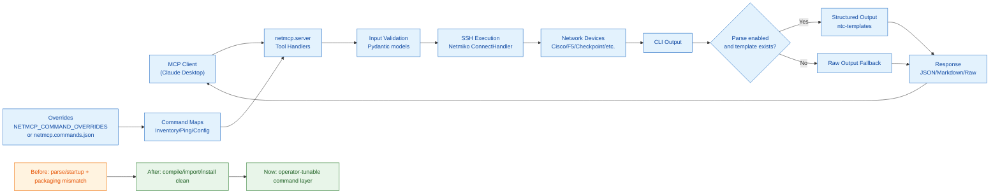

# netmcp Executive Summary (One-Page Visual)

Use this page as the quickest orientation for architecture, remediation status, and operational posture.

- Deep technical narrative: [TECHNICAL_OVERVIEW.md](../strategy/TECHNICAL_OVERVIEW.md)
- Full diagram set: [TECHNICAL_VISUAL_MAP.md](TECHNICAL_VISUAL_MAP.md)

---

## System Snapshot

- **Purpose**: Read-only network operations MCP server over SSH
- **Primary runtime**: Python + FastMCP + Netmiko + ntc-templates
- **Current status**: Startup/build issues fixed, vendor command coverage expanded, runtime overrides added
- **Operational model**: Inputs validated by Pydantic, command execution via SSH, optional parse to structured JSON

---

## One-Page Architecture + Readiness

---

## What Changed (High Value)

- Fixed startup-blocking syntax corruption in `server.py`
- Corrected package metadata for flat layout (`netmcp/`, not `src/netmcp`)
- Updated script entrypoint to stable callable (`netmcp.server:main`)
- Expanded explicit command-map coverage for all advertised vendors
- Added JSON/env override mechanism with validation + startup status reporting

---

## Remaining Hardening Opportunities

- Add automated tests (override merge, map selection, import smoke)
- Add CI workflow for build + lint + smoke checks
- Improve ping success detection beyond heuristic text matching
- Add optional secrets integration (vault/provider)
- Add committed override example file for operators
