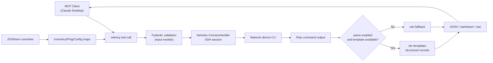
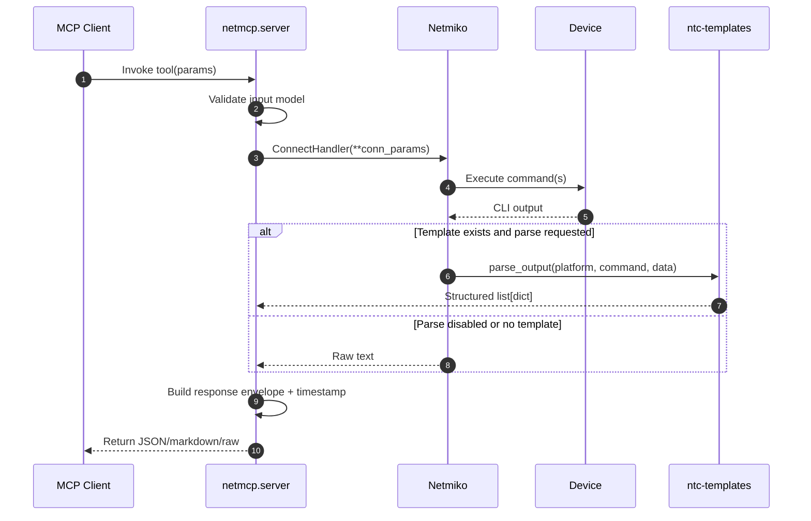
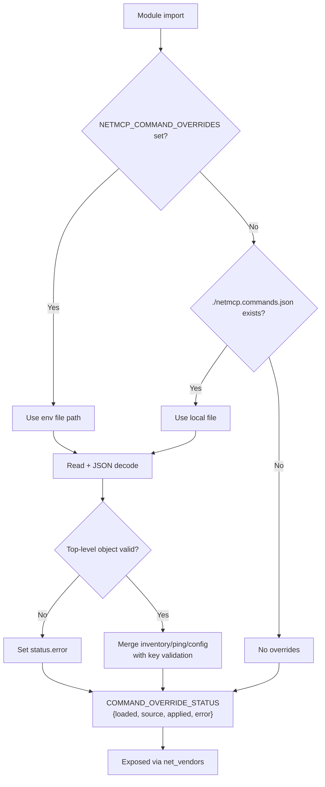
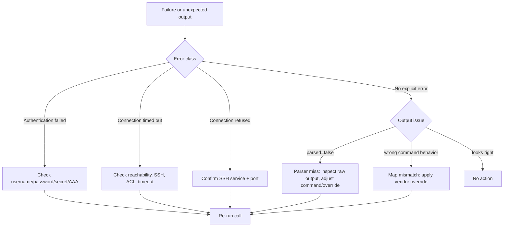

# netmcp Presentation Mode Deck

A single scrollable deck that stitches architecture, remediation, troubleshooting, and operations into one page.

Source docs:

- [TECHNICAL_OVERVIEW.md](../strategy/TECHNICAL_OVERVIEW.md)
- [TECHNICAL_VISUAL_MAP.md](TECHNICAL_VISUAL_MAP.md)
- [EXEC_SUMMARY_VISUAL.md](EXEC_SUMMARY_VISUAL.md)
- [TROUBLESHOOTING_FLOW.md](../ops/TROUBLESHOOTING_FLOW.md)
- [OPERATIONS_RUNBOOK.md](../ops/OPERATIONS_RUNBOOK.md)

---

## Slide 1 — Mission and Scope

**What this is**

- Read-only MCP server for network operations over SSH.
- Converts CLI output into structured data when parser coverage exists.
- Supports multi-vendor workflows with command-map defaults and runtime overrides.

**Current posture**

- Startup and packaging issues remediated.
- Explicit command coverage expanded for all advertised vendors.
- Operator override mechanism added (`NETMCP_COMMAND_OVERRIDES` or local JSON file).

---

## Slide 2 — End-to-End Architecture

---

## Slide 3 — Request Lifecycle (Sequence)

---

## Slide 4 — Tool Surface Area

| Tool                | Primary Job                                           | Notes                            |
| ------------------- | ----------------------------------------------------- | -------------------------------- |
| `net_show`          | Single command execution                              | Optional parse via ntc-templates |
| `net_show_multi`    | Multi-command in one SSH session                      | More efficient for bundles       |
| `net_inventory`     | State snapshot (version/interfaces/routing/neighbors) | Uses vendor map                  |
| `net_ping`          | On-device ping test                                   | Supports source/VRF fields       |
| `net_config_backup` | Running/startup capture                               | Adds metadata header             |
| `net_vendors`       | Capability metadata                                   | Includes override status         |

---

## Slide 5 — What Was Broken Before

- Syntax corruption blocked clean startup in `server.py`.
- Packaging metadata expected `src/` layout while repo is flat package layout.
- Script entrypoint was brittle.
- README launch path pointed to incorrect `cwd`.
- Advertised vendor list exceeded explicit command-map coverage.
- No runtime-safe override mechanism for command tuning.

---

## Slide 6 — What Was Fixed

- Repaired startup parse/runtime blockers in server initialization path.
- Updated `pyproject.toml` package target to `netmcp` (flat layout).
- Updated script entrypoint to explicit callable (`netmcp.server:main`).
- Corrected README `cwd` example to repo root.
- Expanded explicit command maps for:
  - `cisco_ftd`
  - `cisco_xr`
  - `checkpoint`
  - `paloalto_panos`
- Added validated override loader and merge logic with status reporting.

---

## Slide 7 — Override Precedence and Behavior

---

## Slide 8 — Troubleshooting Decision Flow

---

## Slide 9 — Operations Cadence

**Day 1 (bring-up)**

1. Install and register MCP server.
2. Run compile/import/package checks.
3. Validate `net_vendors`, then one known-good `net_show`.
4. Optionally add `netmcp.commands.json`.

**Day 2 (steady state)**

1. Daily health checks (`py_compile`, import, override status).
2. Weekly parser/command drift checks across vendor OS versions.
3. Controlled updates of dependencies and command overrides.
4. Capture evidence bundle on incidents (vendor, command, raw output, error payload, override status).

---

## Slide 10 — Current Gaps and Next Moves

**Gaps**

- No automated tests in repo yet.
- No CI pipeline in this snapshot.
- Ping success detection is heuristic.
- No secrets-provider integration yet.

**Next moves**

1. Add `netmcp.commands.example.json`.
2. Add minimal unit tests (override merge/map resolution/import smoke).
3. Add CI smoke checks (build + import + package).
4. Add short deployment profiles doc (local desktop vs hosted MCP runtime).

---

## Appendix — Presenter Notes

- Emphasize read-only safety model first.
- Show override layer as the key operational flexibility feature.
- Position parser misses as expected edge-cases, not failures.
- Close with test/CI and evidence-capture improvements as next maturity step.
