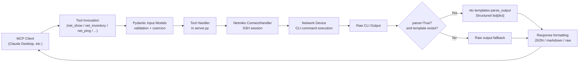
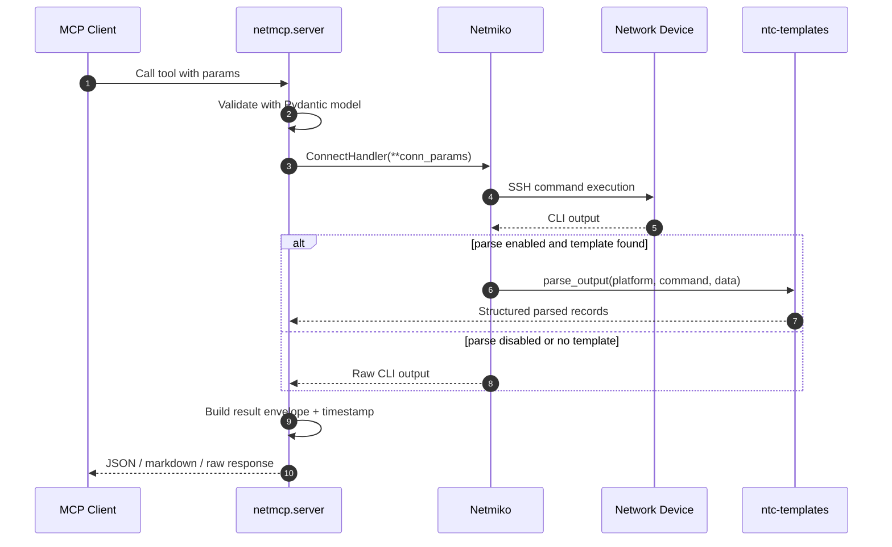
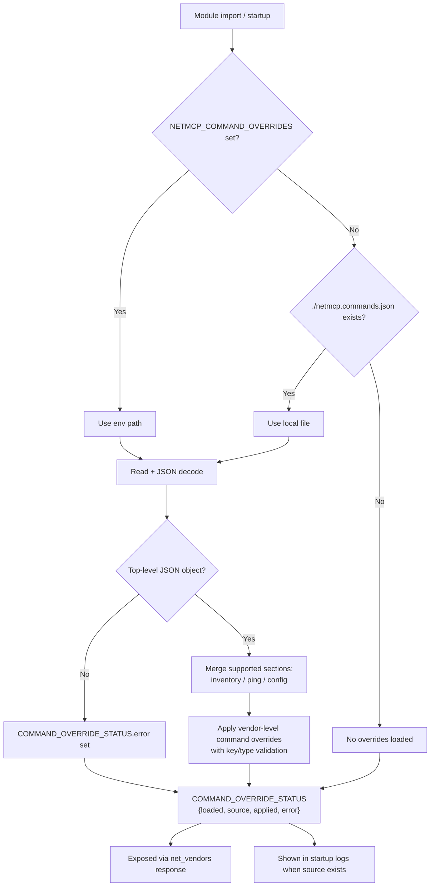
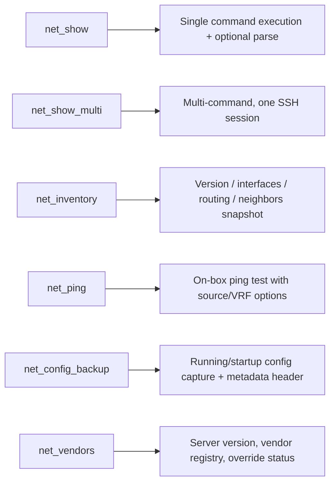
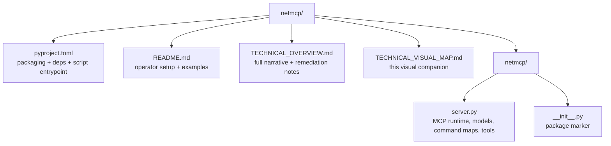
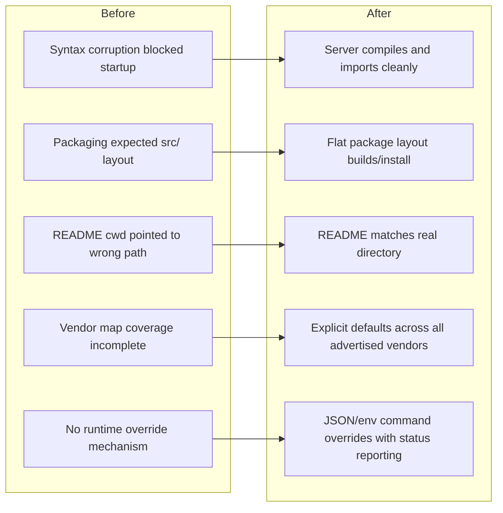

# netmcp Visual Technical Map

This is the visual companion to the technical write-up.

- Narrative deep dive: [TECHNICAL_OVERVIEW.md](../strategy/TECHNICAL_OVERVIEW.md)
- Code implementation: [netmcp/server.py](../../netmcp/server.py)

---

## 1) End-to-end architecture

---

## 2) Request lifecycle (sequence)

---

## 3) Command map resolution and override precedence

---

## 4) Tool responsibility map

---

## 5) Repository structure at a glance

---

## 6) Before vs after remediation

---

## 7) Quick mental model

- `netmcp` is a read-only MCP orchestration layer over SSH CLI.
- `server.py` owns all runtime behavior: schema validation, command routing, session handling, parsing, formatting.
- Vendor command maps define defaults; override JSON lets you tune behavior without code changes.
- The highest-value operational checks are:
  - import/compile health,
  - command-map correctness per vendor,
  - override load status.
